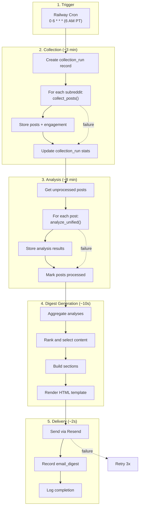

# Digest Design Document

**Version:** 1.0  
**Date:** 2026-01-31  
**Parent Document:** [TECHNICAL_DESIGN.md](./TECHNICAL_DESIGN.md)  
**Related:** [ANALYSIS_DESIGN.md](./ANALYSIS_DESIGN.md)  
**Status:** Draft

---

## Table of Contents

1. [Overview](#1-overview)
2. [Pipeline Orchestration](#2-pipeline-orchestration)
   - 2.1 [Execution Flow](#21-execution-flow)
   - 2.2 [Scheduler Configuration](#22-scheduler-configuration)
   - 2.3 [Pipeline State Machine](#23-pipeline-state-machine)
3. [Collection Layer](#3-collection-layer)
   - 3.1 [Reddit Integration](#31-reddit-integration)
   - 3.2 [Rate Limiting](#32-rate-limiting)
   - 3.3 [Credential Management](#33-credential-management)
   - 3.4 [Error Handling](#34-error-handling)
4. [Digest Generation](#4-digest-generation)
   - 4.1 [Data Aggregation](#41-data-aggregation)
   - 4.2 [Content Selection](#42-content-selection)
   - 4.3 [Section Builders](#43-section-builders)
5. [Email Template](#5-email-template)
   - 5.1 [Template Structure](#51-template-structure)
   - 5.2 [HTML Template](#52-html-template)
   - 5.3 [Plain Text Fallback](#53-plain-text-fallback)
6. [Email Delivery](#6-email-delivery)
   - 6.1 [Resend Integration](#61-resend-integration)
   - 6.2 [Delivery Monitoring](#62-delivery-monitoring)
7. [Observability](#7-observability)
   - 7.1 [Logging Strategy](#71-logging-strategy)
   - 7.2 [Metrics to Track](#72-metrics-to-track)
   - 7.3 [Alerting](#73-alerting)
8. [Edge Cases & Recovery](#8-edge-cases--recovery)
9. [Implementation Checklist](#9-implementation-checklist)

---

## 1. Overview

This document covers the end-to-end digest pipeline:
- Collection orchestration and scheduling
- Data aggregation and content selection
- Email template design and delivery
- Observability and error recovery

**Key Design Goals:**
1. Reliable daily delivery (target: 99%+ success rate)
2. Graceful degradation on partial failures
3. Clear observability for debugging
4. Simple deployment on Railway

---

## 2. Pipeline Orchestration

### 2.1 Execution Flow



### 2.2 Scheduler Configuration

**Railway Cron Setup:**

```toml
# railway.toml
[build]
builder = "nixpacks"

[deploy]
startCommand = "python -m src.main"

[[cron]]
schedule = "0 14 * * *"  # 6 AM PT = 2 PM UTC
command = "python -m src.jobs.daily_digest"
```

**Fallback: APScheduler (for local dev):**

```python
from apscheduler.schedulers.blocking import BlockingScheduler
from apscheduler.triggers.cron import CronTrigger

scheduler = BlockingScheduler()
scheduler.add_job(
    run_daily_digest,
    CronTrigger(hour=6, minute=0, timezone="America/Los_Angeles"),
    id="daily_digest",
    replace_existing=True
)
scheduler.start()
```

### 2.3 Pipeline State Machine

```python
from enum import Enum
from dataclasses import dataclass, field
from datetime import datetime
from typing import Optional

class PipelineState(Enum):
    PENDING = "pending"
    COLLECTING = "collecting"
    ANALYZING = "analyzing"
    GENERATING = "generating"
    DELIVERING = "delivering"
    COMPLETED = "completed"
    FAILED = "failed"

@dataclass
class PipelineRun:
    """Tracks a single pipeline execution."""
    id: str
    started_at: datetime
    state: PipelineState = PipelineState.PENDING
    
    # Collection stats
    subreddits_attempted: int = 0
    subreddits_succeeded: int = 0
    posts_collected: int = 0
    
    # Analysis stats
    posts_analyzed: int = 0
    analysis_failures: int = 0
    
    # Digest stats
    posts_in_digest: int = 0
    
    # Delivery stats
    email_sent: bool = False
    email_id: Optional[str] = None
    
    # Timing
    collection_duration_ms: int = 0
    analysis_duration_ms: int = 0
    generation_duration_ms: int = 0
    total_duration_ms: int = 0
    
    # Errors
    errors: list[str] = field(default_factory=list)
    
    @property
    def is_degraded(self) -> bool:
        """True if pipeline had partial failures."""
        return (
            self.subreddits_succeeded < self.subreddits_attempted or
            self.analysis_failures > 0
        )
    
    @property
    def success_rate(self) -> float:
        """Analysis success rate."""
        total = self.posts_analyzed + self.analysis_failures
        return self.posts_analyzed / total if total > 0 else 0
```

---

## 3. Collection Layer

### 3.1 Reddit Integration

**PRAW handles most complexity for us:**
- OAuth2 authentication (script app flow)
- Rate limiting with automatic backoff
- Pagination and iteration
- Response parsing

**Configuration:**

```python
# src/config.py additions
class Config:
    # Reddit API
    REDDIT_CLIENT_ID = os.getenv("REDDIT_CLIENT_ID")
    REDDIT_CLIENT_SECRET = os.getenv("REDDIT_CLIENT_SECRET")
    REDDIT_USER_AGENT = os.getenv("REDDIT_USER_AGENT", "SocialListener/1.0 by /u/your_username")
    
    # PRAW rate limit config (seconds to wait if rate limited)
    REDDIT_RATELIMIT_SECONDS = int(os.getenv("REDDIT_RATELIMIT_SECONDS", "300"))
    
    # Collection settings
    POSTS_PER_SUBREDDIT = int(os.getenv("POSTS_PER_SUBREDDIT", "20"))
    
    # Target subreddits
    TARGET_SUBREDDITS = [
        "programming",
        "webdev", 
        "dotnet",
        "azure",
        "vscode",
    ]
```

### 3.2 Rate Limiting

**Reddit API Limits:**

| Limit Type | Value | Handling |
|------------|-------|----------|
| Authenticated requests | 60/minute | PRAW automatic |
| Burst requests | 10 in quick succession | PRAW automatic |
| Secondary limits (posting, etc.) | Variable | PRAW `ratelimit_seconds` config |

**PRAW Built-in Handling:**

PRAW automatically:
1. Tracks `X-Ratelimit-*` headers from Reddit
2. Sleeps when approaching limits
3. Retries on rate limit errors (up to `ratelimit_seconds`)
4. Raises `RedditAPIException` if wait exceeds config

```python
import praw

# Configure PRAW with rate limit tolerance
reddit = praw.Reddit(
    client_id=config.REDDIT_CLIENT_ID,
    client_secret=config.REDDIT_CLIENT_SECRET,
    user_agent=config.REDDIT_USER_AGENT,
    ratelimit_seconds=300,  # Wait up to 5 minutes if rate limited
)
```

**Our collection rate (well under limits):**

| Operation | Requests | Time |
|-----------|----------|------|
| 5 subreddits × 20 posts | ~5-10 requests | ~30 seconds |
| Total daily | ~10 requests | Far under 60/min limit |

### 3.3 Credential Management

**Environment Variables (required):**

```bash
# .env file (never commit!)
REDDIT_CLIENT_ID=your_client_id
REDDIT_CLIENT_SECRET=your_client_secret
REDDIT_USER_AGENT=SocialListener/1.0 by /u/yourusername
ANTHROPIC_API_KEY=sk-ant-...
RESEND_API_KEY=re_...
RECIPIENT_EMAILS=natalie@example.com,spencer@example.com
```

**Railway Environment Setup:**

1. Go to Railway project → Variables
2. Add each credential as a variable
3. Railway injects them at runtime

**Credential Validation on Startup:**

```python
def validate_credentials():
    """Validate all required credentials are present."""
    required = [
        ("REDDIT_CLIENT_ID", config.REDDIT_CLIENT_ID),
        ("REDDIT_CLIENT_SECRET", config.REDDIT_CLIENT_SECRET),
        ("ANTHROPIC_API_KEY", config.ANTHROPIC_API_KEY),
        ("RESEND_API_KEY", config.RESEND_API_KEY),
    ]
    
    missing = [name for name, value in required if not value]
    
    if missing:
        raise EnvironmentError(
            f"Missing required credentials: {', '.join(missing)}"
        )
    
    logger.info("All credentials validated")
```

### 3.4 Error Handling

**Collection Error Strategy:**

| Error Type | Handling | Continue? |
|------------|----------|-----------|
| Invalid subreddit | Log warning, skip | Yes |
| Rate limit (recoverable) | PRAW waits automatically | Yes |
| Rate limit (exceeded config) | Log error, skip subreddit | Yes |
| Network timeout | Retry once, then skip | Yes |
| Auth failure | Abort pipeline, alert | No |

```python
def collect_all_subreddits(collector: RedditCollector, subreddits: list[str]) -> CollectionResult:
    """Collect posts from all subreddits with error isolation."""
    result = CollectionResult()
    
    for subreddit in subreddits:
        result.subreddits_attempted += 1
        try:
            posts = collector.collect_posts(
                subreddit=subreddit,
                limit=config.POSTS_PER_SUBREDDIT,
                time_filter="day"
            )
            result.posts.extend(posts)
            result.subreddits_succeeded += 1
            logger.info(f"Collected {len(posts)} posts from r/{subreddit}")
            
        except praw.exceptions.RedditAPIException as e:
            logger.error(f"Reddit API error for r/{subreddit}: {e}")
            result.errors.append(f"r/{subreddit}: {str(e)}")
            
        except Exception as e:
            logger.error(f"Unexpected error for r/{subreddit}: {e}")
            result.errors.append(f"r/{subreddit}: {str(e)}")
    
    return result
```

---

## 4. Digest Generation

### 4.1 Data Aggregation

After individual post analysis, aggregate into digest-ready format:

```python
@dataclass
class DigestData:
    """Aggregated data for digest generation."""
    date: str
    
    # Counts
    total_posts: int
    posts_by_subreddit: dict[str, int]
    
    # Sentiment distribution
    sentiment_counts: dict[str, int]  # {"positive": 40, "neutral": 50, "negative": 10}
    sentiment_percentages: dict[str, float]
    
    # Topics
    topic_frequencies: dict[str, int]  # {"python": 15, "career": 12, ...}
    top_topics: list[str]  # Top 5-10
    
    # Technologies
    tech_frequencies: dict[str, int]
    top_technologies: list[str]
    
    # Selected posts
    top_stories: list[RankedPost]  # Top 5 by engagement
    microsoft_relevant: list[RankedPost]  # Microsoft-related posts
    community_concerns: list[RankedPost]  # Negative sentiment / controversy
    
    # Metadata
    analysis_success_rate: float
    has_warnings: bool


def aggregate_analyses(posts: list[dict], analyses: list[dict]) -> DigestData:
    """Aggregate individual analyses into digest data."""
    # Merge posts with their analyses
    post_map = {p["id"]: p for p in posts}
    
    sentiment_counts = {"positive": 0, "neutral": 0, "negative": 0}
    topic_freq = defaultdict(int)
    tech_freq = defaultdict(int)
    ranked_posts = []
    
    for analysis in analyses:
        post = post_map.get(analysis["post_id"])
        if not post:
            continue
        
        # Count sentiments
        sentiment = analysis.get("sentiment", "neutral")
        sentiment_counts[sentiment] += 1
        
        # Count topics
        for topic in analysis.get("topics", []):
            topic_freq[topic.lower()] += 1
        
        # Count technologies
        for tech in analysis.get("technologies", []):
            tech_freq[tech] += 1
        
        # Calculate rank score
        rank = calculate_digest_rank(post, analysis)
        ranked_posts.append(RankedPost(post=post, analysis=analysis, rank=rank))
    
    # Sort by rank
    ranked_posts.sort(key=lambda x: x.rank, reverse=True)
    
    # Build digest data
    total = sum(sentiment_counts.values())
    return DigestData(
        date=datetime.now().strftime("%Y-%m-%d"),
        total_posts=total,
        posts_by_subreddit=count_by_subreddit(posts),
        sentiment_counts=sentiment_counts,
        sentiment_percentages={k: v/total*100 for k, v in sentiment_counts.items()},
        topic_frequencies=dict(topic_freq),
        top_topics=get_top_n(topic_freq, 10),
        tech_frequencies=dict(tech_freq),
        top_technologies=get_top_n(tech_freq, 5),
        top_stories=ranked_posts[:5],
        microsoft_relevant=[p for p in ranked_posts if p.analysis.get("microsoft_relevant")][:3],
        community_concerns=[p for p in ranked_posts if is_concern(p)][:3],
        analysis_success_rate=len(analyses) / len(posts) if posts else 0,
        has_warnings=len(analyses) < len(posts) * 0.9,
    )
```

### 4.2 Content Selection

**Ranking Algorithm** (from ANALYSIS_DESIGN.md):

```python
def calculate_digest_rank(post: dict, analysis: dict) -> float:
    """Calculate ranking score for digest inclusion."""
    import math
    
    # Base engagement (log scale)
    score = post.get("score", 0)
    comments = post.get("num_comments", 0)
    engagement = math.log1p(score) * 2 + math.log1p(comments) * 1.5
    
    # Sentiment boost
    sentiment = analysis.get("sentiment", "neutral")
    sentiment_boost = {"negative": 1.5, "positive": 1.2, "neutral": 1.0}.get(sentiment, 1.0)
    
    # Confidence weight
    confidence = analysis.get("sentiment_confidence", 0.5)
    
    # Microsoft relevance boost
    ms_boost = 1.5 if analysis.get("microsoft_relevant") else 1.0
    
    # Controversy boost
    controversy_boost = 1.3 if analysis.get("controversy_flag") else 1.0
    
    return engagement * sentiment_boost * ms_boost * controversy_boost * confidence
```

### 4.3 Section Builders

Each digest section has a dedicated builder:

```python
class DigestBuilder:
    """Builds digest sections from aggregated data."""
    
    def build_summary_section(self, data: DigestData) -> str:
        """Build the summary header section."""
        return f"""
        📊 TODAY'S SUMMARY
        • Posts analyzed: {data.total_posts}
        • Positive sentiment: {data.sentiment_percentages['positive']:.0f}%
        • Neutral sentiment: {data.sentiment_percentages['neutral']:.0f}%
        • Negative sentiment: {data.sentiment_percentages['negative']:.0f}%
        • Top topics: {', '.join(data.top_topics[:5])}
        """
    
    def build_top_stories_section(self, stories: list[RankedPost]) -> str:
        """Build the top stories section."""
        lines = ["🔥 TOP STORIES\n"]
        for i, story in enumerate(stories, 1):
            post = story.post
            analysis = story.analysis
            lines.append(f"""
            {i}. {post['title'][:80]}
               r/{post['source']} • {post['score']} pts • {post.get('num_comments', 0)} comments
               Sentiment: {analysis['sentiment']} | {analysis['summary']}
               → {post.get('permalink', post['url'])}
            """)
        return "\n".join(lines)
    
    def build_microsoft_section(self, posts: list[RankedPost]) -> str:
        """Build Microsoft-relevant posts section."""
        if not posts:
            return ""
        
        lines = ["🔷 MICROSOFT ECOSYSTEM\n"]
        for post in posts:
            lines.append(f"• {post.post['title'][:60]}... ({post.analysis['sentiment']})")
        return "\n".join(lines)
    
    def build_concerns_section(self, posts: list[RankedPost]) -> str:
        """Build community concerns section."""
        if not posts:
            return ""
        
        lines = ["⚠️ COMMUNITY CONCERNS\n"]
        for post in posts:
            lines.append(f"• {post.post['title'][:60]}...")
        return "\n".join(lines)
    
    def build_topics_section(self, data: DigestData) -> str:
        """Build trending topics section."""
        lines = ["📈 TRENDING TOPICS\n"]
        for topic in data.top_topics[:5]:
            count = data.topic_frequencies[topic]
            lines.append(f"• {topic}: mentioned in {count} posts")
        return "\n".join(lines)
```

---

## 5. Email Template

### 5.1 Template Structure

| Section | Content | Condition |
|---------|---------|-----------|
| Header | Logo, date, tagline | Always |
| Summary Stats | Post count, sentiment %, top topics | Always |
| Top Stories | Top 5 ranked posts | Always |
| Microsoft Watch | Microsoft-relevant posts | If any exist |
| Community Concerns | Negative/controversy posts | If any exist |
| Trending Topics | Topic frequency list | Always |
| Footer | Generation info, unsubscribe | Always |

### 5.2 HTML Template

```html
<!DOCTYPE html>
<html>
<head>
    <meta charset="utf-8">
    <meta name="viewport" content="width=device-width, initial-scale=1.0">
    <title>Developer Pulse - {{ date }}</title>
    <style>
        body {
            font-family: -apple-system, BlinkMacSystemFont, 'Segoe UI', Roboto, sans-serif;
            line-height: 1.6;
            color: #333;
            max-width: 600px;
            margin: 0 auto;
            padding: 20px;
            background-color: #f5f5f5;
        }
        .container {
            background: white;
            border-radius: 8px;
            padding: 24px;
            box-shadow: 0 2px 4px rgba(0,0,0,0.1);
        }
        .header {
            text-align: center;
            border-bottom: 2px solid #0066cc;
            padding-bottom: 16px;
            margin-bottom: 24px;
        }
        .header h1 {
            margin: 0;
            color: #0066cc;
            font-size: 24px;
        }
        .header .date {
            color: #666;
            font-size: 14px;
        }
        .section {
            margin-bottom: 24px;
        }
        .section-title {
            font-size: 16px;
            font-weight: 600;
            margin-bottom: 12px;
            color: #333;
        }
        .summary-stats {
            display: grid;
            grid-template-columns: repeat(2, 1fr);
            gap: 12px;
            background: #f8f9fa;
            padding: 16px;
            border-radius: 6px;
        }
        .stat {
            text-align: center;
        }
        .stat-value {
            font-size: 24px;
            font-weight: 700;
            color: #0066cc;
        }
        .stat-label {
            font-size: 12px;
            color: #666;
        }
        .story {
            border-left: 3px solid #ddd;
            padding-left: 12px;
            margin-bottom: 16px;
        }
        .story.positive { border-color: #28a745; }
        .story.negative { border-color: #dc3545; }
        .story.neutral { border-color: #6c757d; }
        .story-title {
            font-weight: 600;
            margin-bottom: 4px;
        }
        .story-title a {
            color: #0066cc;
            text-decoration: none;
        }
        .story-title a:hover {
            text-decoration: underline;
        }
        .story-meta {
            font-size: 12px;
            color: #666;
            margin-bottom: 4px;
        }
        .story-summary {
            font-size: 14px;
            color: #444;
        }
        .sentiment-badge {
            display: inline-block;
            padding: 2px 8px;
            border-radius: 12px;
            font-size: 11px;
            font-weight: 500;
        }
        .sentiment-positive { background: #d4edda; color: #155724; }
        .sentiment-negative { background: #f8d7da; color: #721c24; }
        .sentiment-neutral { background: #e2e3e5; color: #383d41; }
        .topic-list {
            display: flex;
            flex-wrap: wrap;
            gap: 8px;
        }
        .topic-tag {
            background: #e9ecef;
            padding: 4px 10px;
            border-radius: 4px;
            font-size: 13px;
        }
        .footer {
            text-align: center;
            font-size: 12px;
            color: #999;
            border-top: 1px solid #eee;
            padding-top: 16px;
            margin-top: 24px;
        }
        .warning {
            background: #fff3cd;
            border: 1px solid #ffc107;
            padding: 12px;
            border-radius: 6px;
            font-size: 13px;
            margin-bottom: 16px;
        }
    </style>
</head>
<body>
    <div class="container">
        <div class="header">
            <h1>📡 Developer Pulse</h1>
            <div class="date">{{ date_formatted }}</div>
        </div>
        
        
        <div class="warning">
            ⚠️ Some posts could not be analyzed. Results may be incomplete.
        </div>
        
        
        <div class="section">
            <div class="section-title">📊 Today's Summary</div>
            <div class="summary-stats">
                <div class="stat">
                    <div class="stat-value">{{ total_posts }}</div>
                    <div class="stat-label">Posts Analyzed</div>
                </div>
                <div class="stat">
                    <div class="stat-value">{{ positive_pct }}%</div>
                    <div class="stat-label">Positive</div>
                </div>
                <div class="stat">
                    <div class="stat-value">{{ negative_pct }}%</div>
                    <div class="stat-label">Negative</div>
                </div>
                <div class="stat">
                    <div class="stat-value">{{ subreddit_count }}</div>
                    <div class="stat-label">Subreddits</div>
                </div>
            </div>
        </div>
        
        <div class="section">
            <div class="section-title">🔥 Top Stories</div>
            
            <div class="story {{ story.sentiment }}">
                <div class="story-title">
                    <a href="{{ story.permalink }}">{{ story.title }}</a>
                </div>
                <div class="story-meta">
                    r/{{ story.subreddit }} • {{ story.score }} pts • {{ story.comments }} comments
                    <span class="sentiment-badge sentiment-{{ story.sentiment }}">{{ story.sentiment }}</span>
                </div>
                <div class="story-summary">{{ story.summary }}</div>
            </div>
            
        </div>
        
        
        <div class="section">
            <div class="section-title">🔷 Microsoft Ecosystem</div>
            
            <div class="story {{ post.sentiment }}">
                <div class="story-title">
                    <a href="{{ post.permalink }}">{{ post.title }}</a>
                </div>
                <div class="story-meta">
                    r/{{ post.subreddit }} • {{ post.score }} pts
                    <span class="sentiment-badge sentiment-{{ post.sentiment }}">{{ post.sentiment }}</span>
                </div>
            </div>
            
        </div>
        
        
        
        <div class="section">
            <div class="section-title">⚠️ Community Concerns</div>
            
            <div class="story negative">
                <div class="story-title">
                    <a href="{{ post.permalink }}">{{ post.title }}</a>
                </div>
                <div class="story-meta">r/{{ post.subreddit }} • {{ post.score }} pts</div>
            </div>
            
        </div>
        
        
        <div class="section">
            <div class="section-title">📈 Trending Topics</div>
            <div class="topic-list">
                
                <span class="topic-tag">{{ topic.name }} ({{ topic.count }})</span>
                
            </div>
        </div>
        
        <div class="footer">
            Generated by Social Listener<br>
            {{ timestamp }} • {{ pipeline_duration }}
        </div>
    </div>
</body>
</html>
```

### 5.3 Plain Text Fallback

```python
def render_plain_text(data: DigestData) -> str:
    """Render plain text email for clients that don't support HTML."""
    lines = [
        "═" * 50,
        "DEVELOPER PULSE",
        f"Daily digest for {data.date}",
        "═" * 50,
        "",
        "📊 TODAY'S SUMMARY",
        f"• Posts analyzed: {data.total_posts}",
        f"• Positive sentiment: {data.sentiment_percentages['positive']:.0f}%",
        f"• Negative sentiment: {data.sentiment_percentages['negative']:.0f}%",
        f"• Top topics: {', '.join(data.top_topics[:5])}",
        "",
        "🔥 TOP STORIES",
        "",
    ]
    
    for i, story in enumerate(data.top_stories, 1):
        post = story.post
        analysis = story.analysis
        lines.extend([
            f"{i}. {post['title'][:70]}",
            f"   r/{post['source']} • {post['score']} pts • {post.get('num_comments', 0)} comments",
            f"   Sentiment: {analysis['sentiment']}",
            f"   {analysis['summary'][:100]}",
            f"   → {post.get('permalink', post['url'])}",
            "",
        ])
    
    lines.extend([
        "─" * 50,
        "Generated by Social Listener",
    ])
    
    return "\n".join(lines)
```

---

## 6. Email Delivery

### 6.1 Resend Integration

**Installation:**

```bash
pip install resend
```

**Email Service:**

```python
import resend
from typing import Optional

class EmailService:
    """Send emails via Resend API."""
    
    def __init__(self, api_key: str):
        resend.api_key = api_key
        self.from_email = "digest@sociallistener.dev"  # Requires verified domain
        # Or use Resend's default: "onboarding@resend.dev"
    
    def send_digest(
        self,
        recipients: list[str],
        subject: str,
        html_content: str,
        text_content: str,
    ) -> Optional[str]:
        """
        Send digest email.
        
        Returns:
            Email ID if successful, None if failed.
        """
        try:
            response = resend.Emails.send({
                "from": self.from_email,
                "to": recipients,
                "subject": subject,
                "html": html_content,
                "text": text_content,
            })
            
            email_id = response.get("id")
            logger.info(f"Email sent successfully: {email_id}")
            return email_id
            
        except resend.exceptions.ResendError as e:
            logger.error(f"Resend API error: {e}")
            return None
        except Exception as e:
            logger.error(f"Email send error: {e}")
            return None
    
    def send_with_retry(
        self,
        recipients: list[str],
        subject: str,
        html_content: str,
        text_content: str,
        max_retries: int = 3,
    ) -> Optional[str]:
        """Send with exponential backoff retry."""
        import time
        
        for attempt in range(max_retries):
            result = self.send_digest(recipients, subject, html_content, text_content)
            if result:
                return result
            
            if attempt < max_retries - 1:
                wait_time = 2 ** attempt * 5  # 5s, 10s, 20s
                logger.warning(f"Email send failed, retrying in {wait_time}s...")
                time.sleep(wait_time)
        
        logger.error(f"Email send failed after {max_retries} attempts")
        return None
```

### 6.2 Delivery Monitoring

**Track in database:**

```python
def record_email_digest(
    db: DatabaseManager,
    sent_at: datetime,
    recipients: list[str],
    post_count: int,
    status: str,
    email_id: Optional[str] = None,
    subject: str = "",
) -> None:
    """Record email digest in database for tracking."""
    db.execute("""
        INSERT INTO email_digests 
        (sent_at, recipients, post_count, status, email_id, subject)
        VALUES (?, ?, ?, ?, ?, ?)
    """, (
        sent_at.isoformat(),
        ",".join(recipients),
        post_count,
        status,
        email_id,
        subject,
    ))
```

---

## 7. Observability

### 7.1 Logging Strategy

**Structured logging with context:**

```python
import logging
import json
from datetime import datetime

class StructuredLogger:
    """JSON-formatted logging for Railway."""
    
    def __init__(self, name: str):
        self.logger = logging.getLogger(name)
        self.run_id = None
    
    def set_run_id(self, run_id: str):
        self.run_id = run_id
    
    def _log(self, level: str, message: str, **kwargs):
        log_entry = {
            "timestamp": datetime.utcnow().isoformat(),
            "level": level,
            "message": message,
            "run_id": self.run_id,
            **kwargs
        }
        print(json.dumps(log_entry))
    
    def info(self, message: str, **kwargs):
        self._log("INFO", message, **kwargs)
    
    def error(self, message: str, **kwargs):
        self._log("ERROR", message, **kwargs)
    
    def warning(self, message: str, **kwargs):
        self._log("WARNING", message, **kwargs)

# Usage
logger = StructuredLogger("social-listener")
logger.set_run_id("run_20260131_060000")
logger.info("Collection started", subreddits=5, target_posts=100)
logger.info("Collection complete", posts_collected=87, duration_ms=2341)
```

### 7.2 Metrics to Track

| Metric | Type | Purpose |
|--------|------|---------|
| `pipeline_duration_ms` | Gauge | Overall performance |
| `posts_collected` | Counter | Collection health |
| `posts_analyzed` | Counter | Analysis throughput |
| `analysis_failures` | Counter | Error rate |
| `email_sent` | Boolean | Delivery success |
| `api_cost_usd` | Gauge | Cost tracking |

**End-of-run summary log:**

```python
def log_pipeline_summary(run: PipelineRun):
    """Log comprehensive pipeline summary."""
    logger.info(
        "Pipeline complete",
        run_id=run.id,
        status="success" if run.email_sent else "failed",
        posts_collected=run.posts_collected,
        posts_analyzed=run.posts_analyzed,
        analysis_failures=run.analysis_failures,
        success_rate=f"{run.success_rate:.1%}",
        duration_ms=run.total_duration_ms,
        is_degraded=run.is_degraded,
        errors=run.errors if run.errors else None,
    )
```

### 7.3 Alerting

**Simple alerting via email (Phase 1):**

If pipeline fails completely, send alert email to Spencer:

```python
def send_failure_alert(error: str, run: PipelineRun):
    """Send alert email on pipeline failure."""
    email_service.send_digest(
        recipients=["spencer@example.com"],  # Admin only
        subject=f"🚨 Social Listener Pipeline Failed - {run.id}",
        html_content=f"""
            <h2>Pipeline Failure Alert</h2>
            <p><strong>Run ID:</strong> {run.id}</p>
            <p><strong>Error:</strong> {error}</p>
            <p><strong>State:</strong> {run.state.value}</p>
            <p><strong>Posts collected:</strong> {run.posts_collected}</p>
            <p><strong>Posts analyzed:</strong> {run.posts_analyzed}</p>
            <h3>Errors:</h3>
            <pre>{json.dumps(run.errors, indent=2)}</pre>
        """,
        text_content=f"Pipeline failed: {error}. Check Railway logs.",
    )
```

---

## 8. Edge Cases & Recovery

| Scenario | Detection | Response |
|----------|-----------|----------|
| **No posts collected** | `posts_collected == 0` | Skip analysis, send "quiet day" email |
| **All analyses fail** | `analysis_failures == posts_collected` | Send degraded digest with just post titles |
| **Email send fails** | `send_with_retry() returns None` | Alert Spencer, log error, continue |
| **Partial collection** | `subreddits_succeeded < attempted` | Continue with available data, note in digest |
| **Very slow pipeline** | `duration > 30 min` | Log warning, consider timeout |
| **Duplicate run** | Second cron trigger while running | Check for lock, skip if running |

**Quiet day email:**

```python
def send_quiet_day_email(date: str, recipients: list[str]):
    """Send email when no posts were collected."""
    email_service.send_digest(
        recipients=recipients,
        subject=f"Developer Pulse - {date} | Quiet day",
        html_content="""
            <h1>📡 Developer Pulse</h1>
            <p>No significant developer discussions were found today in the monitored subreddits.</p>
            <p>This could mean:</p>
            <ul>
                <li>A quiet day in the dev community</li>
                <li>The subreddits are experiencing low activity</li>
                <li>Collection encountered issues (check logs)</li>
            </ul>
        """,
        text_content="Quiet day - no posts collected.",
    )
```

---

## 9. Implementation Checklist

### Prerequisites (from ANALYSIS_DESIGN.md)

- [ ] Update RedditCollector with `num_comments`, `permalink`, `upvote_ratio`
- [ ] Collect sample data for validation
- [ ] Implement unified analyzer

### Phase 1: Core Pipeline

- [ ] **Create pipeline orchestrator** - Main entry point, state tracking
- [ ] **Implement DigestData aggregation** - Combine analyses
- [ ] **Build ranking algorithm** - Score and sort posts
- [ ] **Create section builders** - Each digest section
- [ ] **Create HTML template** - Jinja2 template
- [ ] **Create plain text template** - Fallback

### Phase 1: Delivery

- [ ] **Set up Resend account** - Get API key
- [ ] **Implement EmailService** - Send with retry
- [ ] **Add email tracking** - Record in database

### Phase 1: Deployment

- [ ] **Configure Railway cron** - 6 AM PT schedule
- [ ] **Set environment variables** - All credentials
- [ ] **Add structured logging** - JSON format
- [ ] **Test end-to-end** - Full pipeline run

### Phase 2: Reliability

- [ ] Add failure alerting
- [ ] Add quiet day handling
- [ ] Add degraded mode (partial failures)
- [ ] Add duplicate run prevention

---

## Revision History

| Version | Date | Author | Changes |
|---------|------|--------|---------|
| 1.0 | 2026-01-31 | Spencer | Initial draft |

---

*End of Digest Design Document*
