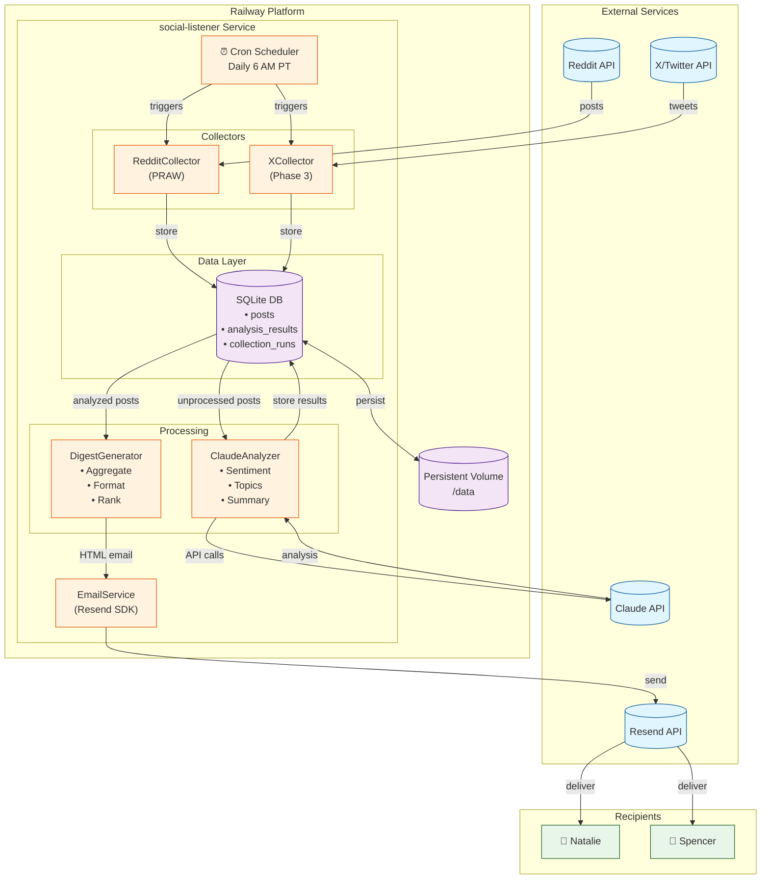
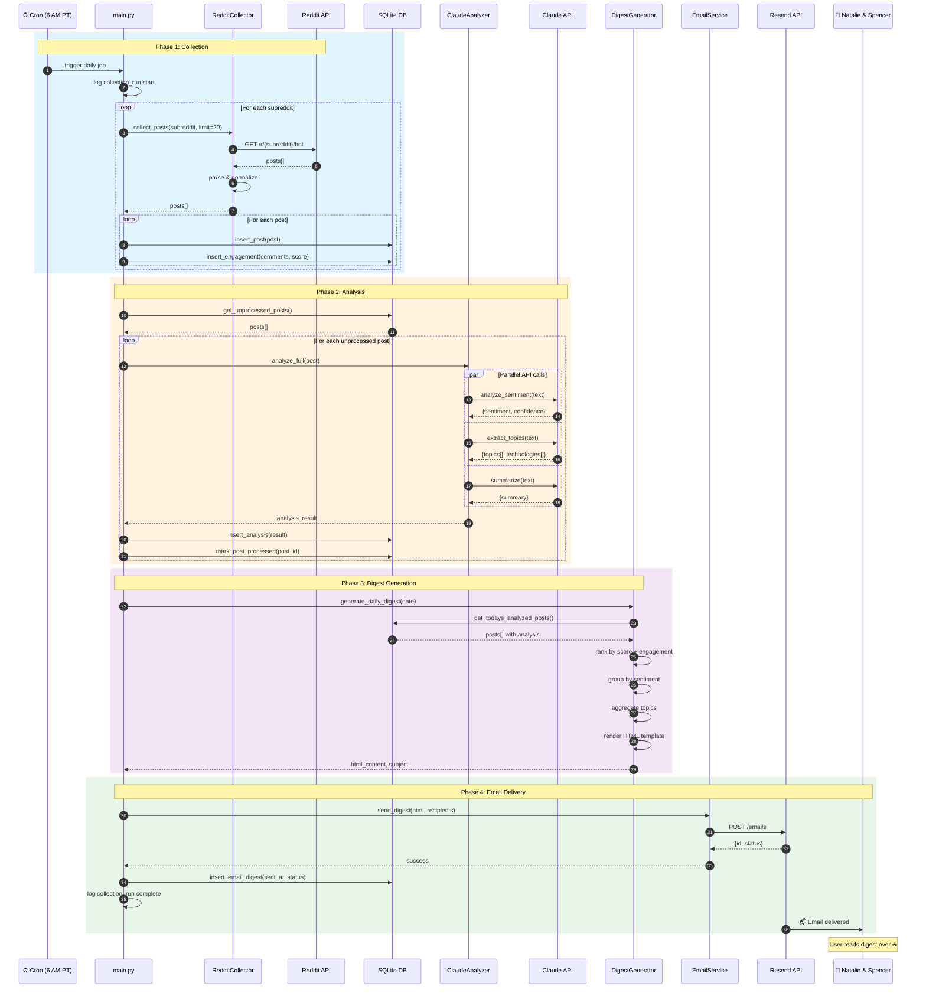

# Social Listener - Technical Design Document

**Version:** 1.4  
**Date:** 2026-01-31  
**Authors:** Spencer (CTO), with AI assistance  
**Status:** Draft for Review

---

## Table of Contents

1. [Executive Summary](#1-executive-summary)
2. [User & Context](#2-user--context)
   - 2.1 [Primary User](#21-primary-user)
   - 2.2 [Secondary User](#22-secondary-user)
   - 2.3 [Usage Pattern](#23-usage-pattern)
3. [Success Metrics](#3-success-metrics)
   - 3.1 [Primary Metric: Coverage](#31-primary-metric-coverage)
   - 3.2 [Secondary Metric: Accuracy](#32-secondary-metric-accuracy)
   - 3.3 [Quantitative Audit Process](#33-quantitative-audit-process)
4. [System Architecture](#4-system-architecture)
   - 4.1 [High-Level Overview](#41-high-level-overview)
   - 4.2 [Component Details](#42-component-details)
   - 4.3 [Deployment Architecture](#43-deployment-architecture-railway)
   - 4.4 [Architecture Diagram](#44-architecture-diagram)
   - 4.5 [Post Lifecycle Sequence Diagram](#45-post-lifecycle-sequence-diagram)
5. [Data Model](#5-data-model)
   - 5.1 [Current Schema](#51-current-schema-unchanged)
   - 5.2 [New Tables Required](#52-new-tables-required)
6. [Implementation Phases](#6-implementation-phases)
   - 6.1 [Phase 1: Foundation (MVP)](#61-phase-1-foundation-mvp)
   - 6.2 [Phase 2: Reliability & Quality](#62-phase-2-reliability--quality)
   - 6.3 [Phase 3: X/Twitter Integration](#63-phase-3-xtwitter-integration)
   - 6.4 [Phase 4: Enhanced Analysis](#64-phase-4-enhanced-analysis)
   - 6.5 [Phase 5: Web Dashboard (Optional)](#65-phase-5-web-dashboard-optional)
   - 6.6 [Recommended Priority Order](#66-recommended-priority-order)
7. [Cost Estimates](#7-cost-estimates)
   - 7.1 [Assumptions by Tier](#71-assumptions-by-tier)
   - 7.2 [Token Estimates per Post](#72-token-estimates-per-post)
   - 7.3 [Monthly AI API Costs](#73-monthly-ai-api-costs)
   - 7.4 [Railway Hosting Costs](#74-railway-hosting-costs)
   - 7.5 [Email Costs](#75-email-costs)
   - 7.6 [Total Monthly Cost Summary](#76-total-monthly-cost-summary)
8. [Technical Decisions](#8-technical-decisions)
   - 8.1 [AI Provider](#81-decision-ai-provider)
   - 8.2 [Email Service](#82-decision-email-service)
   - 8.3 [Hosting Platform](#83-decision-hosting-platform)
   - 8.4 [Authentication](#84-decision-authentication)
9. [Risks & Mitigations](#9-risks--mitigations)
10. [Open Items](#10-open-items)
11. [Appendices](#11-appendices)
    - A. [Target Subreddits](#appendix-a-target-subreddits-suggested)
    - B. [Email Digest Template](#appendix-b-email-digest-template-draft)
12. [Related Documents](#12-related-documents)

---

## 1. Executive Summary

Social Listener is a custom application for Natalie Wossene, a marketing leader at Microsoft, to monitor developer community conversations across Reddit and X/Twitter. The tool collects posts, analyzes them using AI, and delivers a daily email digest summarizing significant events.

**Primary Goal:** Learn vibe-coding development practices while building something potentially useful.

**Secondary Goal:** If successful, the tool may be shared more broadly.

---

## 2. User & Context

### 2.1 Primary User

| Attribute | Value |
|-----------|-------|
| Name | Natalie Wossene |
| Role | Marketing Leader, Microsoft |
| Need | Understand daily developer sentiment and trending topics |
| Consumption | Daily email digest |

### 2.2 Secondary User

| Attribute | Value |
|-----------|-------|
| Name | Spencer |
| Role | CTO / Developer |
| Need | System monitoring, configuration |
| Consumption | Same email digest + system access |

### 2.3 Usage Pattern

- **Frequency:** Daily digest delivered each morning
- **Interaction:** Read-only consumption (no web UI required initially)
- **Authentication:** Single shared credential for both users

---

## 3. Success Metrics

### 3.1 Primary Metric: Coverage

> "Does it capture every event of significance in the day?"

| Metric | Target | Measurement Method |
|--------|--------|-------------------|
| **Significant Event Recall** | ≥90% | Weekly manual audit: review top posts from monitored boards, confirm they appear in digests |
| **False Negative Rate** | ≤10% | Count significant posts missed vs total significant posts |

**Definition of "Significant":**
- Posts with ≥50 upvotes/reactions within 24 hours
- Posts mentioning monitored keywords (Microsoft, Azure, VS Code, GitHub, Copilot, etc.)
- Posts with ≥20 comments indicating active discussion

### 3.2 Secondary Metric: Accuracy

> "Does it characterize them accurately?"

| Metric | Target | Measurement Method |
|--------|--------|-------------------|
| **Sentiment Accuracy** | ≥85% | Weekly spot-check: manually classify 20 posts, compare to AI classification |
| **Topic Relevance** | ≥80% | Audit extracted topics against post content |
| **Summary Quality** | Subjective | Natalie's weekly feedback: "Were summaries useful?" (1-5 scale) |

### 3.3 Quantitative Audit Process

**Weekly (15 min):**
1. Select 5 random posts from the week's digests
2. Read original post content
3. Score: Sentiment correct? (Y/N), Topics relevant? (Y/N), Summary accurate? (Y/N)
4. Log results in spreadsheet
5. Calculate rolling 4-week accuracy

**Monthly (30 min):**
1. Review top 20 posts from each monitored subreddit (by score)
2. Confirm each appeared in a digest
3. Calculate recall rate
4. Identify any patterns in misses

---

## 4. System Architecture

### 4.1 High-Level Overview

```
┌─────────────────┐     ┌─────────────────┐     ┌─────────────────┐
│   Data Sources  │     │    Processing   │     │     Output      │
│                 │     │                 │     │                 │
│  ┌───────────┐  │     │  ┌───────────┐  │     │  ┌───────────┐  │
│  │  Reddit   │──┼────▶│  │ Collector │──┼────▶│  │  SQLite   │  │
│  │   API     │  │     │  │           │  │     │  │    DB     │  │
│  └───────────┘  │     │  └───────────┘  │     │  └─────┬─────┘  │
│                 │     │                 │     │        │        │
│  ┌───────────┐  │     │  ┌───────────┐  │     │        ▼        │
│  │  X/Twitter│──┼────▶│  │ Analyzer  │──┼────▶│  ┌───────────┐  │
│  │   API     │  │     │  │ (Claude/  │  │     │  │  Email    │  │
│  └───────────┘  │     │  │  GPT)     │  │     │  │  Digest   │  │
│                 │     │  └───────────┘  │     │  └───────────┘  │
└─────────────────┘     └─────────────────┘     └─────────────────┘
                                                        │
                                                        ▼
                                                 ┌─────────────┐
                                                 │  Natalie &  │
                                                 │   Spencer   │
                                                 └─────────────┘
```

### 4.2 Component Details

| Component | Technology | Purpose |
|-----------|------------|---------|
| **Scheduler** | Railway Cron / APScheduler | Trigger daily collection at 6 AM PT |
| **Reddit Collector** | PRAW (existing) | Fetch posts from 5 subreddits |
| **X Collector** | Tweepy / X API v2 | Fetch posts (Phase 3) |
| **Analyzer** | Claude Sonnet 4.5 or GPT-5.2 | Sentiment, topics, summaries |
| **Database** | SQLite | Store posts, analysis, run history |
| **Email Service** | Resend | Deliver daily digest |
| **Hosting** | Railway | Run scheduled jobs, host app |

### 4.3 Deployment Architecture (Railway)

```
Railway Project
├── Service: social-listener (Python)
│   ├── Cron: Daily collection (0 6 * * *)
│   └── Environment Variables
│       ├── REDDIT_CLIENT_ID
│       ├── REDDIT_CLIENT_SECRET
│       ├── ANTHROPIC_API_KEY (or OPENAI_API_KEY)
│       ├── RESEND_API_KEY
│       └── RECIPIENT_EMAILS
└── Volume: /data (SQLite persistence)
```

### 4.4 Architecture Diagram



### 4.5 Post Lifecycle Sequence Diagram

This diagram shows the complete lifecycle of a single post from collection to email delivery.



**Lifecycle Summary:**

| Phase | Duration | Key Operations |
|-------|----------|----------------|
| 1. Collection | ~2-3 min | Fetch 100 posts from 5 subreddits |
| 2. Analysis | ~5-8 min | 3 Claude API calls per post |
| 3. Digest | ~10 sec | Aggregate, rank, render HTML |
| 4. Delivery | ~2 sec | Send via Resend |
| **Total** | **~10-15 min** | |

---

## 5. Data Model

### 5.1 Current Schema (Unchanged)

```sql
-- Posts table
posts (
    id TEXT PRIMARY KEY,
    source TEXT NOT NULL,        -- subreddit name or X handle
    platform TEXT NOT NULL,      -- 'reddit' or 'x'
    title TEXT,
    content TEXT,
    author TEXT,
    url TEXT,
    score INTEGER DEFAULT 0,
    created_at TIMESTAMP,
    collected_at TIMESTAMP,
    processed INTEGER DEFAULT 0
)

-- Analysis results
analysis_results (
    id INTEGER PRIMARY KEY,
    post_id TEXT,
    analysis_type TEXT,
    sentiment TEXT,              -- 'positive', 'neutral', 'negative'
    topics TEXT,                 -- comma-separated
    summary TEXT,
    raw_analysis TEXT,
    created_at TIMESTAMP
)
```

### 5.2 New Tables Required

```sql
-- Track collection runs
collection_runs (
    id INTEGER PRIMARY KEY,
    started_at TIMESTAMP,
    completed_at TIMESTAMP,
    posts_collected INTEGER,
    posts_analyzed INTEGER,
    status TEXT,                 -- 'success', 'partial', 'failed'
    error_message TEXT
)

-- Track email digests sent
email_digests (
    id INTEGER PRIMARY KEY,
    sent_at TIMESTAMP,
    recipients TEXT,             -- comma-separated emails
    post_count INTEGER,
    status TEXT,                 -- 'sent', 'failed'
    subject TEXT
)

-- Engagement metrics (new - for counting reactions/comments)
post_engagement (
    id INTEGER PRIMARY KEY,
    post_id TEXT,
    comment_count INTEGER,
    reaction_count INTEGER,      -- upvotes for Reddit, likes for X
    collected_at TIMESTAMP,
    FOREIGN KEY(post_id) REFERENCES posts(id)
)
```

---

## 6. Implementation Phases

### 6.1 Phase 1: Foundation (MVP)

**Goal:** Daily email digest from Reddit with AI analysis

| Task | Description | Complexity |
|------|-------------|------------|
| 6.1.1 | Add Resend email service integration | Medium |
| 6.1.2 | Create email digest template (HTML) | Low |
| 6.1.3 | Add digest generation logic | Medium |
| 6.1.4 | Configure 5 target subreddits | Low |
| 6.1.5 | Add engagement metrics collection (comment/reaction counts) | Low |
| 6.1.6 | Deploy to Railway with cron schedule | Medium |
| 6.1.7 | Add collection run tracking | Low |

**Deliverable:** Natalie receives daily email with top posts, sentiment, topics, summaries

---

### 6.2 Phase 2: Reliability & Quality

**Goal:** Improve accuracy and add monitoring

| Task | Description | Complexity |
|------|-------------|------------|
| 6.2.1 | Add error handling and retry logic | Medium |
| 6.2.2 | Add logging to Railway logs | Low |
| 6.2.3 | Create weekly audit spreadsheet template | Low |
| 6.2.4 | Add keyword filtering (Microsoft, Azure, etc.) | Low |
| 6.2.5 | Improve prompt engineering for better analysis | Medium |
| 6.2.6 | Add confidence scores to analysis output | Low |

**Deliverable:** Reliable daily delivery with measurable accuracy

---

### 6.3 Phase 3: X/Twitter Integration

**Goal:** Add X as a data source

| Task | Description | Complexity |
|------|-------------|------------|
| 6.3.1 | Implement X collector (requires paid API) | High |
| 6.3.2 | Normalize X data to match Reddit format | Medium |
| 6.3.3 | Update digest template for multi-platform | Low |
| 6.3.4 | Test with limited X keywords | Medium |

**Deliverable:** Combined Reddit + X digest

---

### 6.4 Phase 4: Enhanced Analysis

**Goal:** Deeper insights

| Task | Description | Complexity |
|------|-------------|------------|
| 6.4.1 | Add trend detection (topic frequency over time) | High |
| 6.4.2 | Add comparative analysis (week-over-week) | Medium |
| 6.4.3 | Implement "alert" threshold for viral posts | Medium |
| 6.4.4 | Add entity extraction (people, products mentioned) | Medium |

**Deliverable:** Richer digest with trends and alerts

---

### 6.5 Phase 5: Web Dashboard (Optional)

**Goal:** Visual interface for historical data

| Task | Description | Complexity |
|------|-------------|------------|
| 6.5.1 | Build simple web UI (Flask/FastAPI) | High |
| 6.5.2 | Add authentication | Medium |
| 6.5.3 | Create data visualizations | High |
| 6.5.4 | Add search/filter capabilities | Medium |

**Deliverable:** Web interface for browsing historical data

---

### 6.6 Recommended Priority Order

Based on the learning goal and delivering value quickly:

```
Phase 1 (MVP)           ████████████████████░░░░░░░░  ~2-3 sessions
Phase 2 (Reliability)   ████████████░░░░░░░░░░░░░░░░  ~1-2 sessions
Phase 3 (X/Twitter)     ████████████████░░░░░░░░░░░░  ~2 sessions (if API acquired)
Phase 4 (Analysis)      ████████████████████░░░░░░░░  ~2-3 sessions
Phase 5 (Dashboard)     ████████████████████████████  ~4+ sessions (defer)
```

**Rationale:**
- Phase 1 gets value to Natalie immediately
- Phase 2 ensures trust in the system
- Phase 3 depends on X API access (cost decision)
- Phase 4 adds nice-to-have depth
- Phase 5 is deferred unless email proves insufficient

---

## 7. Cost Estimates

### 7.1 Assumptions by Tier

| Tier | Posts/Day | Subreddits | Analysis Runs | Use Case |
|------|-----------|------------|---------------|----------|
| **Small** | 100 | 5 | 1/day | Initial testing |
| **Medium** | 500 | 10 | 1/day | Expanded coverage |
| **Large** | 2,000 | 20+ | 2/day | Full production |

### 7.2 Token Estimates per Post

| Operation | Input Tokens | Output Tokens |
|-----------|--------------|---------------|
| Sentiment analysis | ~300 | ~50 |
| Topic extraction | ~300 | ~100 |
| Summarization | ~300 | ~150 |
| **Total per post** | **~900** | **~300** |

### 7.3 Monthly AI API Costs

#### 7.3.1 Claude Sonnet 4.5

**Pricing:** $3.00/M input tokens, $15.00/M output tokens

| Tier | Posts/Month | Input Cost | Output Cost | **Total/Month** |
|------|-------------|------------|-------------|-----------------|
| Small | 3,000 | $0.0081 | $0.0135 | **$0.02** |
| Medium | 15,000 | $0.0405 | $0.0675 | **$0.11** |
| Large | 60,000 | $0.162 | $0.27 | **$0.43** |

#### 7.3.2 GPT-5.2

**Pricing:** $1.75/M input tokens, $14.00/M output tokens

| Tier | Posts/Month | Input Cost | Output Cost | **Total/Month** |
|------|-------------|------------|-------------|-----------------|
| Small | 3,000 | $0.0047 | $0.0126 | **$0.02** |
| Medium | 15,000 | $0.0236 | $0.063 | **$0.09** |
| Large | 60,000 | $0.0945 | $0.252 | **$0.35** |

#### 7.3.3 GPT-5 Mini (Budget Option)

**Pricing:** $0.25/M input tokens, $2.00/M output tokens

| Tier | Posts/Month | Input Cost | Output Cost | **Total/Month** |
|------|-------------|------------|-------------|-----------------|
| Small | 3,000 | $0.0007 | $0.0018 | **$0.003** |
| Medium | 15,000 | $0.0034 | $0.009 | **$0.01** |
| Large | 60,000 | $0.0135 | $0.036 | **$0.05** |

### 7.4 Railway Hosting Costs

| Plan | Monthly Cost | Included Credits | Estimated Usage | Net Cost |
|------|--------------|------------------|-----------------|----------|
| Hobby | $5.00 | $5.00 | ~$2-3 | **$5.00** |
| Pro | $20.00 | $20.00 | ~$2-3 | **$20.00** |

**Recommendation:** Start with Hobby plan. Cron job running 10-15 min/day uses minimal resources.

### 7.5 Email Costs

For 1-2 emails per day (~60/month), free tiers are more than sufficient.

| Provider | Free Tier | Paid Tier | Notes |
|----------|-----------|-----------|-------|
| **Resend** | 3,000 emails/month | $20/mo for 50k | **Recommended.** Modern API, simple SDK, great DX. Free tier includes 1 custom domain. |
| **Mailgun** | 1,000 emails/month (Flex plan) | Pay-as-you-go | Good alternative. More complex setup. |
| **AhaSend** | 1,000 emails/month | Pay-as-you-go | Focused on transactional email speed. |
| **Postmark** | 100 emails/month | $15/mo for 10k | Higher quality but limited free tier. |
| SendGrid | No free tier (was discontinued) | $20/mo minimum | **Not recommended.** No longer has a usable free tier. |

**Decision:** Use **Resend**. 3,000 emails/month free tier covers our needs indefinitely (we send ~60/month). Simple Python SDK, modern API, reliable delivery.

### 7.6 Total Monthly Cost Summary

| Tier | AI (Claude 4.5) | AI (GPT-5.2) | Hosting | Email | **Total** |
|------|-----------------|--------------|---------|-------|-----------|
| Small | $0.02 | $0.02 | $5.00 | $0 | **~$5** |
| Medium | $0.11 | $0.09 | $5.00 | $0 | **~$5** |
| Large | $0.43 | $0.35 | $5.00 | $0 | **~$5.50** |

**Key Insight:** AI and email costs are negligible at these volumes. Railway hosting ($5/mo) is the primary cost driver.

---

## 8. Technical Decisions

### 8.1 Decision: AI Provider

| Option | Pros | Cons | Recommendation |
|--------|------|------|----------------|
| Claude Sonnet 4.5 | Already integrated, excellent reasoning | Slightly higher cost | **Recommended** |
| GPT-5.2 | Lower input cost, larger context | Requires new integration | Alternative |
| GPT-5 Mini | Cheapest | Lower quality for nuanced analysis | Not recommended |

**Decision:** Continue with Claude Sonnet 4.5 (existing integration, proven quality)

### 8.2 Decision: Email Service

| Option | Pros | Cons | Recommendation |
|--------|------|------|----------------|
| **Resend** | 3,000/mo free, modern API, simple SDK | Newer company | **Recommended** |
| Mailgun | Established, flexible pricing | More complex setup | Alternative |
| Postmark | High deliverability | Small free tier (100/mo) | Not ideal |
| SendGrid | Industry standard | No free tier, $20/mo minimum | **Not recommended** |

**Decision:** Use Resend for simplicity and generous free tier

### 8.3 Decision: Hosting Platform

| Option | Pros | Cons | Recommendation |
|--------|------|------|----------------|
| Railway | Simple deploys, built-in cron, volume storage | $5/mo minimum | **Recommended** |
| Render | Similar to Railway | Cron requires paid plan | Alternative |
| AWS Lambda | Pay only for execution | More complex, cold starts | Overkill |
| Local (cron) | Free | Requires always-on machine | Not reliable |

**Decision:** Use Railway Hobby plan

### 8.4 Decision: Authentication

| Option | Pros | Cons | Recommendation |
|--------|------|------|----------------|
| None (email only) | Simplest, no auth needed | Can't extend to web UI later | **Recommended for MVP** |
| Shared password | Simple | Password management | Later if web UI needed |
| OAuth | Proper auth | Overkill for 2 users | Much later |

**Decision:** No auth for MVP (email-only output)

---

## 9. Risks & Mitigations

| Risk | Likelihood | Impact | Mitigation |
|------|------------|--------|------------|
| Reddit API rate limiting | Medium | Medium | Implement backoff, stay under limits |
| AI hallucination in analysis | Low | Medium | Spot-check weekly, prompt engineering |
| Email delivery failures | Low | High | Use reliable provider (Resend), add retry logic |
| Railway downtime | Low | Medium | Monitor runs, alert on missed digests |
| X API too expensive | High | Low | Defer X integration, Reddit is sufficient |
| Data volume assumptions wrong | Medium | Medium | Revisit after 2 weeks of testing |

---

## 10. Open Items

| # | Item | Owner | Status |
|---|------|-------|--------|
| 1 | Select 5 initial subreddits to monitor | Natalie | Pending |
| 2 | Define Microsoft-related keywords for filtering | Natalie | Pending |
| 3 | Confirm email addresses for digest | Spencer | Pending |
| 4 | Set up Railway account and project | Spencer | Pending |
| 5 | Create Resend account and get API key | Spencer | Pending |
| 6 | Decide on X API investment (Phase 3) | Spencer/Natalie | Deferred |

---

## 11. Appendices

### Appendix A: Target Subreddits (Suggested)

Initial 5 for testing:

1. `r/programming` - General programming discussions
2. `r/webdev` - Web development community
3. `r/dotnet` - .NET/Microsoft stack
4. `r/azure` - Azure cloud platform
5. `r/vscode` - VS Code editor

Alternative/expansion candidates:
- `r/github`, `r/devops`, `r/typescript`, `r/csharp`, `r/microsoft`

---

### Appendix B: Email Digest Template (Draft)

```
Subject: Developer Pulse - [Date] | [X] posts analyzed

───────────────────────────────────────────────
DEVELOPER PULSE
Daily digest for [Date]
───────────────────────────────────────────────

📊 TODAY'S SUMMARY
• Posts analyzed: [X]
• Positive sentiment: [X%]
• Negative sentiment: [X%]
• Top topics: [topic1], [topic2], [topic3]

🔥 TOP STORIES

1. [Post Title]
   r/[subreddit] • [score] pts • [comments] comments
   Sentiment: [positive/neutral/negative]
   Summary: [AI-generated summary]
   → [URL]

2. [Post Title]
   ...

⚠️ NOTABLE NEGATIVE SENTIMENT
[If any posts with negative sentiment about Microsoft/Azure/etc.]

📈 TRENDING TOPICS
• [Topic]: mentioned in [X] posts
• [Topic]: mentioned in [X] posts

───────────────────────────────────────────────
Generated by Social Listener
Questions? Reply to this email.
```

---

## 12. Related Documents

| Document | Purpose | Status |
|----------|---------|--------|
| [ANALYSIS_DESIGN.md](./ANALYSIS_DESIGN.md) | NLP strategy, prompt design, structured outputs | Draft |
| [DIGEST_DESIGN.md](./DIGEST_DESIGN.md) | Pipeline orchestration, email template, delivery | Draft |
| ../SCRATCH_PRD_ANALYSIS.md | Initial PRD gap analysis | Complete |

---

## Revision History

| Version | Date | Author | Changes |
|---------|------|--------|---------|
| 1.0 | 2026-01-31 | Spencer | Initial draft |
| 1.1 | 2026-01-31 | Spencer | Added section numbering; updated email service recommendation to Resend (SendGrid no longer has free tier) |
| 1.2 | 2026-01-31 | Spencer | Added architecture diagram (4.4) and post lifecycle sequence diagram (4.5) |
| 1.3 | 2026-01-31 | Spencer | Added Related Documents section (12); linked to ANALYSIS_DESIGN.md |
| 1.4 | 2026-01-31 | Spencer | Linked DIGEST_DESIGN.md in Related Documents |

---

*End of Technical Design Document*
